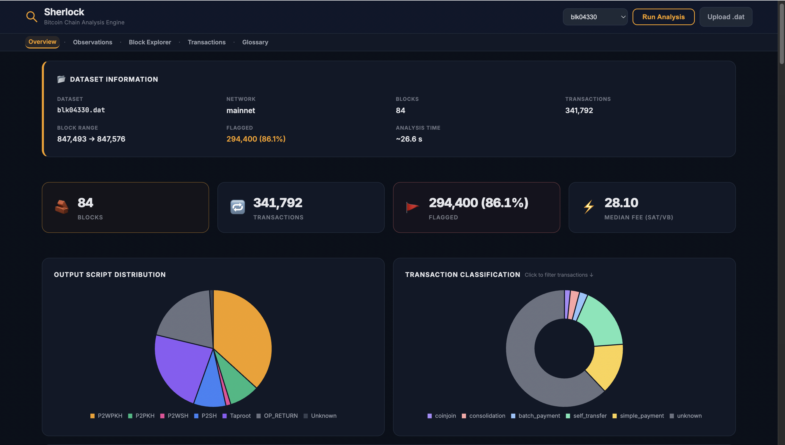

> Most Bitcoin tools show transactions. Sherlock shows behavior.

# Sherlock

**Understand how Bitcoin transactions actually behave — directly from raw block data, no node required.**

> Built from first principles — no nodes, no APIs, just raw blockchain data.

[](https://github.com/SakshiKasat18/sherlock/actions/workflows/ci.yml)


---

## What is Sherlock?

Most blockchain explorers show you what happened. They surface txids, amounts, and block heights. What they don't show you — and what isn't obvious from any public API — is *how* transactions behave: which inputs likely belong to the same wallet, which outputs are change being returned to the sender, whether a transaction is a CoinJoin disguising a payment, or a consolidation sweep cleaning up a fragmented UTXO set.

That behavioral layer is encoded in the structure of the transactions themselves. It requires parsing the raw binary, resolving the inputs back to their original UTXOs, and then applying analytical heuristics designed to surface intent — not just movement.

Most tools that claim to do this either require a fully synced Bitcoin node, a commercial API key, or operate as a black box.

Sherlock works entirely offline. Feed it a raw `blk.dat` file and its companion `rev.dat` undo data — and it produces a structured, machine-readable breakdown of every transaction: what it is, what it signals, and what it reveals about the entities behind it.

> Built as part of Summer of Bitcoin 2026 (Week 3) and extended into a standalone chain analysis engine.

---

## What This Reveals

The output isn't just statistics. Each of these is a real behavioral signal extracted from the chain:

- **Which transactions are CoinJoins** — equal-value outputs from multi-party inputs, masking the real payment path
- **Which outputs are change** — inferred from script type matching against inputs, round-number probability, and output position
- **How wallets consolidate funds** — UTXO sweeps with many inputs and one or two outputs, revealing wallet hygiene patterns
- **Who is paying multiple recipients at once** — batch payment patterns used by exchanges, payroll, and mixing services
- **Where fee rates cluster** — min / median / mean / max across an entire block file, exposing mempool dynamics at a point in time
- **Which addresses reuse scripts** — same scriptPubKey in both inputs and outputs; a direct privacy failure signal
- **Which payments use round amounts** — a statistical signal separating human-set transfers from algorithmic ones

This is behavioral analysis, not data presentation.

---

## How It Works

```
Raw blk.dat + rev.dat + xor.dat
          ↓
    XOR Decoder              ← strips Bitcoin Core's file-level XOR mask
          ↓
    Block File Iterator      ← locates magic bytes, reads block boundaries
          ↓
    Block + TX Parser        ← full SegWit-aware binary decoding; computes txid
                               stripping witness data per BIP141
          ↓
    Prevout Resolver         ← matches each input against rev.dat undo records
                               to recover original UTXO values and compute fees
          ↓
    Heuristic Engine         ← 7 deterministic classifiers run against every
                               enriched transaction; each returns {detected, confidence}
          ↓
    Transaction Classifier   ← resolves heuristic signals into a single primary
                               behavior label per transaction
          ↓
    Stats Collector          ← single-pass aggregation of fee rates, script types,
                               classification distribution, detection counts
          ↓
    JSON + Markdown Reports  ← written to out/ for CLI use or served by web layer
          ↓
       ┌──────────────┐
       │  CLI         │  ./cli.sh --block blk.dat rev.dat xor.dat
       │  Web UI      │  http://127.0.0.1:3000
       └──────────────┘
```

Each stage is a separate module. `analyzer.py` is the only orchestrator — no module calls another except through it.

---

## Why This Approach Is Different

Most chain analysis tools operate as black boxes or depend on fully indexed nodes. They give you answers without showing the reasoning.

Sherlock works directly on raw block data, reconstructing transaction context from first principles. Every classification is traceable, deterministic, and explainable — not inferred from external datasets or proprietary heuristics. You can read the code for any detection and understand exactly why a transaction was flagged.

---

## Web UI

The UI is not just a dashboard — it turns raw blockchain data into something you can explore, question, and reason about.



**Dataset selection** — choose from pre-analyzed block files or upload your own `.dat` file directly through the browser. Analyzed datasets are distinguished from available-but-unprocessed ones in the dropdown.

**Run Analysis** — the explicit trigger. Select a dataset, click Run Analysis, the full pipeline executes server-side. No implicit auto-triggers, no race conditions.

**Overview** — block count, transaction count, flagged transaction rate, median fee rate. The numbers that tell you what kind of activity is in the file.

**Script Distribution** — pie chart of P2WPKH / P2TR / P2SH / P2PKH / P2WSH / OP_RETURN across all outputs. Shows the script type adoption curve at a glance.

**Transaction Classification** — donut chart of behavior labels: CoinJoin, Consolidation, Batch Payment, Simple Payment, Self Transfer, Unknown. Clickable — filters the transaction explorer instantly.

**Heuristic Detections** — horizontal bar chart of how many transactions triggered each heuristic, sorted by count. Clicking any bar filters to matching transactions.

**Transaction Explorer** — paginated, searchable, filterable by classification and heuristic. Each card shows inputs, outputs, fee, fee rate, classification, and per-heuristic confidence chips with tooltips.

**Block Explorer** — paginated table of all blocks in the file: height, timestamp, tx count, coinbase txid.

**Glossary** — in-page definitions of every heuristic and classification term.

**Web API:**

| Endpoint | Method | Description |
|---|---|---|
| `GET /api/health` | — | Health check |
| `GET /api/blocks` | — | List available datasets (analyzed + fixture) |
| `GET /api/block/<stem>` | — | Serve precomputed report from `out/` |
| `POST /api/analyze` | JSON body | Run pipeline on a fixture, return report |
| `POST /api/upload` | multipart | Upload a `.dat` file, register it for analysis |

---

## Features

- **SegWit-aware parser** — decodes serialized transactions including witness fields; computes correct txid by stripping witness data per BIP141
- **Prevout resolution** — recovers original UTXO values from `rev.dat` undo records; enables exact fee and fee-rate calculation
- **7-heuristic engine** — pluggable `HeuristicBase` ABC; each heuristic returns `{detected, confidence, method}`; adding a new one requires one file
- **Transaction classification** — resolves all heuristic signals into a primary behavior label with explicit priority rules
- **Single-pass stats** — fee rates, script distribution, classification counts, detection counts collected in one traversal
- **XOR decoding** — strips Bitcoin Core's 8-byte XOR file mask before parsing
- **Zero external dependencies** — core pipeline is pure Python stdlib; no Bitcoin libraries, no RPC, no API
- **JSON + Markdown output** — machine-readable report and human-readable summary written to `out/`
- **Interactive web dashboard** — full analysis lifecycle: select → analyze → explore

---

## Architecture

```
sherlock/
├── sherlock/
│   ├── parser/
│   │   ├── xor.py               # XOR key loader and block decryption
│   │   ├── block_file.py        # Magic-byte iterator over blk*.dat
│   │   ├── block.py             # Block header + tx list decoder
│   │   ├── transaction_parser.py# SegWit-aware tx decoder; txid computation
│   │   ├── transaction_model.py # ParsedBlock / ParsedTransaction dataclasses
│   │   ├── script.py            # scriptPubKey type classification
│   │   └── undo.py              # rev.dat loader; prevout resolution
│   ├── heuristics/
│   │   ├── base.py              # HeuristicBase ABC — {detected, confidence} contract
│   │   ├── engine.py            # Registry + run_heuristics() + classify_transaction()
│   │   ├── cioh.py              # Common Input Ownership
│   │   ├── change_detection.py  # Script-type match, round-number, position
│   │   ├── coinjoin.py          # Equal-value output detection
│   │   ├── consolidation.py     # Many-input → few-output pattern
│   │   ├── batch_payment.py     # One-sender → many-recipient pattern
│   │   ├── round_number_payment.py  # Round BTC amount detection
│   │   └── address_reuse.py    # Input/output script overlap
│   ├── analysis/
│   │   ├── analyzer.py          # Orchestrator — the only entry point
│   │   ├── classifier.py        # Heuristic → classification resolution
│   │   ├── stats.py             # Single-pass StatsCollector
│   │   ├── report_json.py       # JSON report writer
│   │   └── report_md.py         # Markdown report writer
│   └── utils/
│       ├── varint.py            # Bitcoin variable-length integer decoder
│       ├── hashing.py           # Double-SHA256 utilities
│       └── io.py                # Byte-level read helpers
├── web/
│   ├── server.py                # stdlib HTTP server (5 API endpoints)
│   └── static/
│       ├── index.html           # Single-page dashboard
│       ├── app.js               # State machine + Chart.js rendering
│       └── styles.css
├── tests/
│   ├── test_parser.py           # Block iteration and XOR decoding
│   ├── test_heuristics.py       # Heuristic engine with synthetic transactions
│   ├── test_block_parsing.py    # Full block parse against fixture
│   └── test_prevout_resolution.py  # Prevout resolution + fee computation
├── examples/                    # Sample output reports
├── assets/                      # UI screenshots
├── railway.toml                 # Railway deployment config
├── Procfile                     # Process declaration (Railway / Render)
├── Makefile                     # install / test / analyze / run
└── pyproject.toml
```

**Data flow:** `analyzer.py` is the single entry point. It calls `block_file → block → transaction_parser → undo → engine → classifier → stats → report_json/md` in sequence. No module calls another except through it.

---

## Quick Start

**Install:**

```bash
git clone https://github.com/SakshiKasat18/sherlock.git
cd sherlock
make install        # or: pip install -e ".[dev]"
```

**CLI:**

```bash
make analyze        # runs against fixtures/blk04330.dat by default
# or explicitly:
./cli.sh --block fixtures/blk04330.dat fixtures/rev04330.dat fixtures/xor.dat
# Output written to out/blk04330.json and out/blk04330.md
```

**Web UI:**

```bash
make run            # or: ./web.sh
# Open http://127.0.0.1:3000
```

---

## Heuristics

Each heuristic is deterministic and returns a confidence level alongside its detection flag.

| Heuristic | What it detects | Confidence model |
|-----------|-----------------|-----------------|
| **CIOH** | Common Input Ownership — multiple inputs likely controlled by one entity | Always `high` when ≥2 inputs |
| **Change Detection** | Likely change output — script type match, round-number, or position | `high` / `medium` / `low` by method |
| **CoinJoin** | Privacy mixing — equal-value outputs from ≥2 inputs | `high` when ≥3 equal outputs |
| **Consolidation** | UTXO sweep — many inputs, 1–2 outputs | Scaled by input count |
| **Batch Payment** | One-to-many — single input cluster, ≥3 distinct outputs | `high` when outputs are heterogeneous |
| **Round Number** | Human payment amounts — exact BTC boundaries (0.001, 0.01, 0.1…) | `medium` always |
| **Address Reuse** | Script overlap — same scriptPubKey in inputs and outputs | `high` always |

Confidence model details and known limitations are documented in [`APPROACH.md`](./APPROACH.md).

---

## Running Tests

```bash
make install        # installs pytest + pytest-cov
make test           # pytest tests/ -v --tb=short
make test-cov       # with coverage report
```

Tests cover block iteration, XOR decoding, prevout resolution, fee invariants (min ≤ median ≤ max), heuristic detection, and classification output schema.

---

## Deployment

Sherlock is designed for local or containerized environments. Due to long-running analysis (15–30s per block file) and filesystem write requirements, serverless platforms like Vercel are not suitable.

**Railway (recommended):**

```bash
npm i -g @railway/cli
railway login
railway up
```

Railway picks up `railway.toml` automatically. The server binds to `0.0.0.0:$PORT` and the health check at `/api/health` confirms startup. No code changes required.

**Local:**

```bash
make run            # http://127.0.0.1:3000
```

---

## Part of a Larger Bitcoin Toolkit

```
ChainLens  →  CoinSmith  →  Sherlock
Understand →  Build      →  Analyze
```

- **ChainLens** — parse and visualize Bitcoin transactions from raw block data
- **CoinSmith** — construct and sign PSBTs offline from structured inputs
- **Sherlock** — analyze transaction behavior at scale *(this project)*

Sherlock operates at the end of the pipeline: it takes the raw data that ChainLens decodes and the transaction structures that CoinSmith builds, and asks what those transactions reveal about the entities behind them.

---

## License

MIT

---

## Acknowledgements

Built as part of [Summer of Bitcoin 2026](https://www.summerofbitcoin.org/) — Week 3 challenge.

---

*Sherlock is not about parsing transactions — it's about understanding the behavior hidden inside them.*
